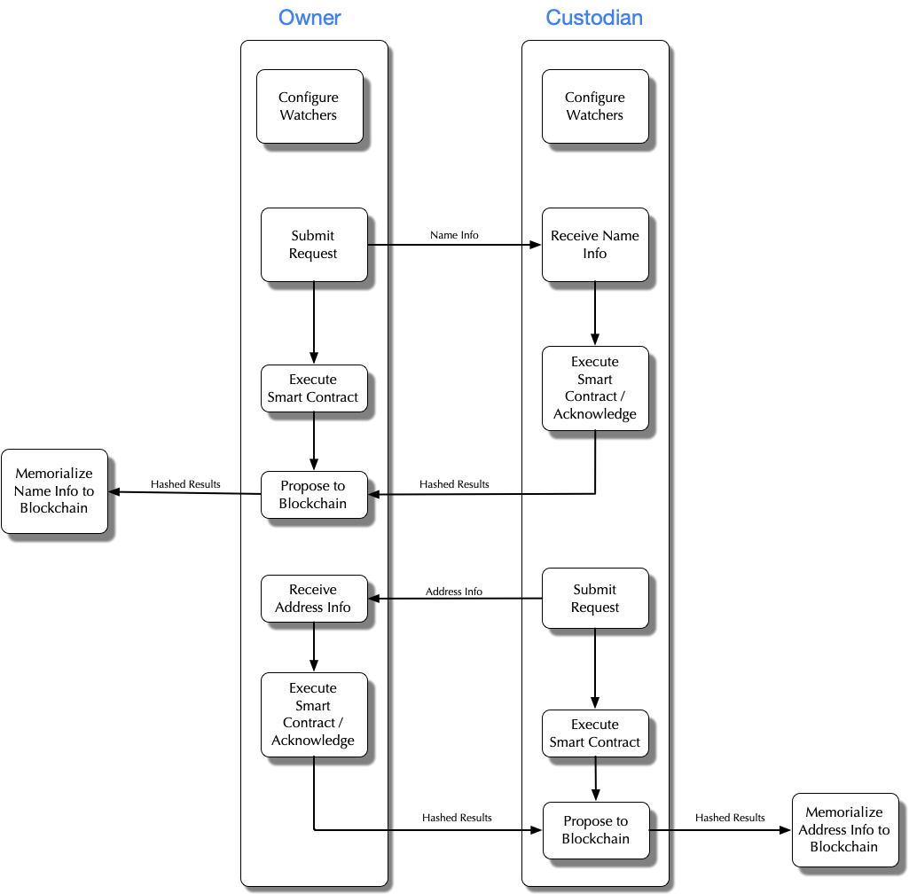

# Multi-Step Contract Example

Multi-step contracts are those where processes are required between contract steps or where contract steps are initiated by different affiliates.

This example contract consists of two participants - an owner and a custodian. The contract is initiated by the owner and consists of the owner providing name information. The custodian receives and acknowledges the request, executes the contract, acknowledges the response, and then the process is on hold waiting for the next step. The next step consists of the custodian adding address information to the contract and executing it again. The owner receives and acknowledges the request, executes the contract, and acknowledges the response. As each step completes, the information is memorialized to the blockchain. The following diagram outlines the process.

## Transaction Flow



1. The owner and custodian each create request and response watchers to listen for contract messages.
   1. The owner response watcher listens for output from the first step where they initiate the transaction. The owner request watcher listens for when the custodian executes the second step.
   2. The custodian request watcher listens for when the owner executes the first step. The custodian response watcher listens for output from the second step where they initiate the transaction.
2. The owner invokes the contract with name information and waits for the custodian’s response.
3. The custodian is notified of the contract and name information via the request watcher.
4. The custodian executes the contract and acknowledges by returning true from the watcher.
5. The hashed execution results of the contract executions are sent to Provenance where nodes endorse the transaction.
6. Once the nodes achieve consensus, the transaction is memorialized to the blockchain.
7. At this point the contract status is incomplete because address information hasn’t been provided yet.
8. Now that the name is a fact \(due to it being memorialized to the blockchain\), the custodian can execute the second step of the contract.
9. The custodian executes the contract with address information and waits for the owner’s response.
10. The owner is notified of the contract and address information via the request watcher.
11. The owner invokes the contract and acknowledges by returning true from the watcher.
12. The hashed execution results of the contracts are sent to Provenance where nodes endorse the transaction.
13. Once the nodes achieve consensus, the transaction is memorialized to the blockchain.
14. At this point the contract status is complete since all inputs have been provided \(name and address information\).

## Multi-Step Contract

The HelloWorldMultiStepContract \(HelloWorld.kt and HelloWorldJavaContracts.java in the p8e-contract project\) is an example of a multi-step contract between two participants. The first step in this example consists of name information being submitted by an owner, as identified by the Function annotation. The second step consists of address information being added to the transaction by a custodian. The order of the steps is enforced by the Fact annotation on the address function. This ensures name information has been previously memorialized to the blockchain before the address function will execute. The hashed results of each step will be memorialized to the blockchain once all participants involved have successfully executed the steps.

```kotlin
@Participants(roles = [OWNER, CUSTODIAN])
open class HelloWorldMultiStepContract() : P8eContract() {
    @Function(invokedBy = OWNER)
    @Fact(name = "name")
    open fun name(@Input(name = "name") name: ExampleName ) = name

    @Function(invokedBy = CUSTODIAN)
    @Fact(name = "address")
    open fun address(@Fact(name = "name") name: ExampleName,
                     @Input(name = "address") address: ExampleAddress ) = address
}
```

## Multi-Step Contract Watchers

This example consists of two participants. Each participant is required to configure watchers to listen for messages from each step in the contract execution. The watchers each have a different purpose based on the participant. Due to the configuration of this type of contracts, to execute this example you will have to fulfill the roles of both the owner and custodian. This means you will be responsible for starting the watchers for each of these two participants.

The owner in this example is initiating the first step so watchers are needed to acknowledge messages from when the process for that step completes. Watchers are also needed so the owner can receive a message when the second step of the contract is ready to execute.

Similarly, the custodian in this example is initiating the second step so watchers are needed to acknowledge messages from when the process for that step completes. Watchers are also needed so the custodian can receive a message when the first step of the contract is ready to execute. In this example the custodian is going to always immediately execute the second step. In a real world example the second step most likely won’t always be automatically executed. To support this delay, the execution UUID must be persisted so it can be used later to retrieve the contract to execute.

```kotlin
val contractManagerOwner = ContractManager.create("<owner_private_key_text>".toJavaPrivateKey(), "<api_url>")
contractManagerOwner.watchBuilder(HelloWorldMultiStepContract::class.java)
                    .executeRequests()
                    .watch()

val contractManagerCustodian = ContractManager.create("<custodian_private_key_text>".toJavaPrivateKey(), "<api_url>")
contractManagerCustodian.watchBuilder(HelloWorldMultiStepContract::class.java)
                        .executeRequests()
                        .watch()
```

Note how the watchers for both participants are the same except for the primary keys used to create the contract managers. This is because the purpose is the same - to simply execute the contract to ensure all parties involved are in agreement.

## Multi-Step Contract Execution

Once the watchers are configured and started the contract is ready to be executed. The owner initiates the contract the same way as a single-step contract is executed. The other participants involved are identified with the satisfyParticipant function and information is added with the addProposedFact function.

```kotlin
contractManager.newContract(HelloWorldMultiStepContract::class.java, OWNER).apply {
    satisfyParticipant(CUSTODIAN, <custodian's public key>)
    addProposedFact("name", ExampleName.newBuilder()
                                       .setFirstName("Hello")
                                       .setLastName("World")
                                       .build())
    contractManager.execute(this)
```

Executing this step of the contract will trigger the request handler for the custodian. Once the custodian executes the contract, it will trigger the step completion handlers for the owner and custodian. At this point the hashed results of the first step will be memorialized to the blockchain. The transaction will now be on hold until the custodian initiates the second step of the contract.

This process requires the same contract as the first step to be executed. This is accomplished by using the execution UUID from the first step to load the contract. New information is added to the contract before it is executed.

```kotlin
val contract = contractManager.loadContract(HelloWorldMultiStepContract::class.java, <execution UUID>)
if (!contract.isCompleted()) {
    contract.addProposedFact("address", ExampleAddress.newBuilder()
                                                      .setStreet("100 N Main")
                                                      .setCity("Helena")
                                                      .setState("MT")
                                                      .setZip("59601")
                                                      .build())
    contractManager.execute(contract)
} else {
    log.info("Execution UUID: $executionUuid is already completed")
}
```

Executing this step of the contract will trigger the request handler but this time for the owner. Once the owner executes the contract, it will trigger the same step completion handlers for the owner and custodian. At this point the hashed results of the second step will be memorialized to the blockchain. The transaction is now complete.

