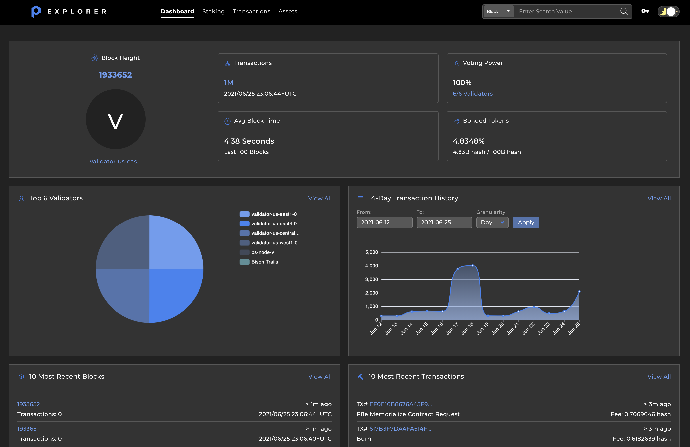
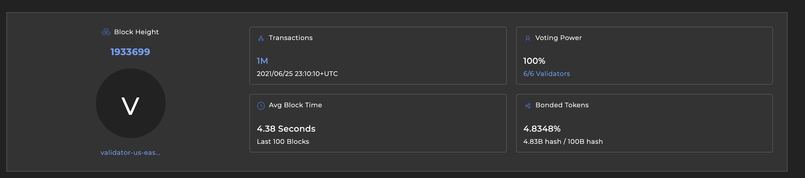
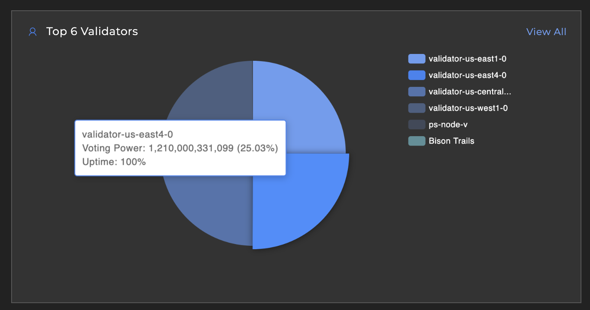
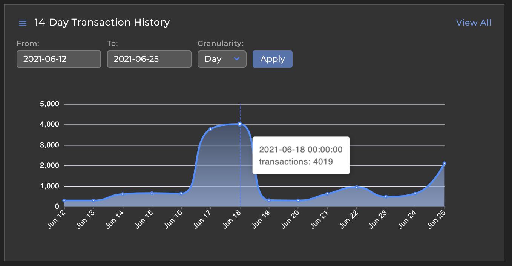
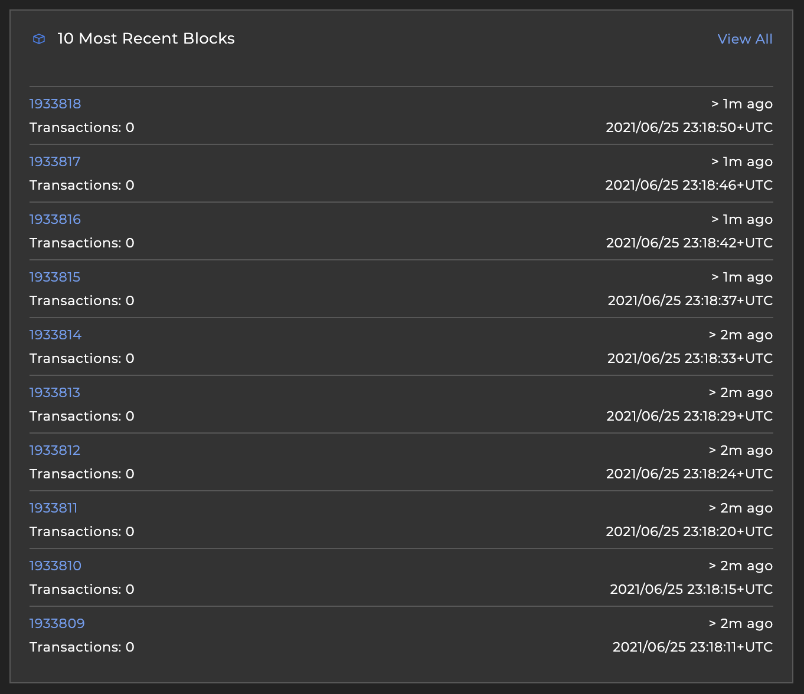
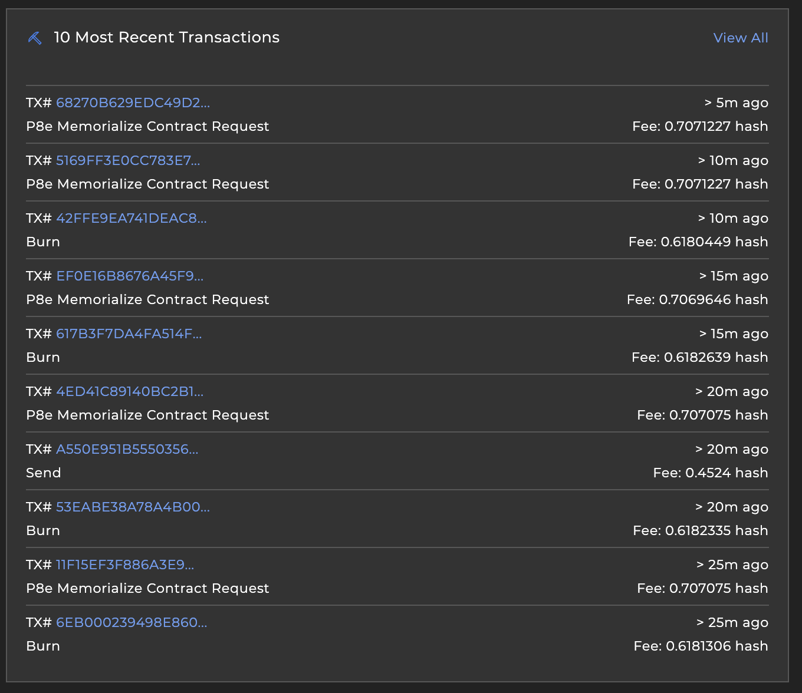

# Dashboard

As the main landing page for the Explorer, this provides a general, current overview of Provenance.

## Latest Provenance Statistics

In the top section, you will find general statistics about Provenance as a chain.

* **Block Height**: the current height on Provenance, including the block's proposer
* **Transactions**: the current approximate number of total transactions written onto Provenance
* **Voting Power**: the current total voting power that took part in the voting for the last block; includes the total validator count on Provenance
* **Avg Block Time**: across the last 100 blocks on Provenance, on average how long it took to commit a block
* **Bonded Tokens**: the percentage of tokens present on Provenance that are bonded to a **staking validator**; includes approximate values for bonded to total tokens ratio

## Top Validators

The `Top 6 Validators` chart shows a breakdown by voting power from the top active validators on Provenance. The hover-over includes the total bonded token count, percentage of total voting power, and uptime percentage

## 14-Day Transaction History

The `Transaction History` chart shows a breakdown of transaction count across a maximum 14 day spread, broken down by **Day** or **Hour**. The hover-over shows the actual count for the break down.

## 10 Most Recent Blocks

As the heading describes, this list shows the 10 most recent blocks committed to Provenance. 

* **Block Height**: the height of the block, links to the block's detail
* **Transaction count**: the number of transactions included in the block
* **Block Timestamp**: the timestamp the block was committed at, adjusted to UTC

## 10 Most Recent Transactions

This list shows the 10 most recent transactions committed to Provenance. 

* **TX\#**: the transaction hash assigned to the transaction; links to the transaction's detail
* **Transaction type**: the type of message included in the transaction; if there is more than one distinct type, a `+additional` would show to indicate how many more message types are included
* **Time since included**: the time that has elapsed since the transaction was included in a block
* **Fee amount**: the fee that was paid to include the transaction in a block; shown in **hash**

