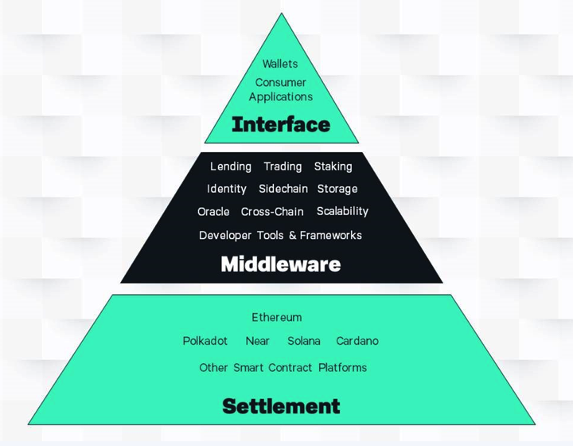

# Application Architecture

TODO: Describe the typical application architecture and build a mental model - this \(from a competitor :\|\) is a good model to start from except, obviously, Provenance in the Settlement foundation:

Consumer Application == Figure Passport, Marketplace, Figure Pay

Middleware == Origination, Servicing \(e.g. genesis and maintenance of Assets\)

Settlement == bilateral SCs, ownership transfers, trading, fiat &lt;=&gt; stablecoin

Develop a diagram, based on maybe Figure Marketplace, that shows origination -&gt; CEE -&gt; funding -&gt; pool building -&gt; trading/exchanging -&gt; and settlement of loan assets?

This section is the architecture of a typical application built on Provenance.

**Keep in mind, we're still introductory at this point.**

