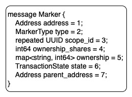

# Marker Module

## Overview

Using the blockchain as a ledger requires the ability to track fungible and non-fungible resources on chain with fractional ownership. Each of these resources requires rules governing supply and exchange. Examples of resources include fractional ownership in the network itself \(stake\), credits for network resources \(gas/fees\), fractional ownership of an arbitrary contract \(markers\), and omnibus account balances \(stable coins\). The rules governing the asset must be enforced by the blockchain itself such that the entity controlling the asset must abide by these rules and is not able to invalidate these processes. These enforced constraints are what provide the value and support trust in the platform itself.

* **Coin** - A transferable instance with a unique name matching a token and whole integer value.
* **Token** - A token is representation of digital value stored on the blockchain enumerated in coins.
* **Marker** - A special type of Token represented by a contract that maintains an ownership structure and an optional collection of assets.

#### Coins

Coins on Provenance Blockchain are a simple structure composed of an integer amount and a string denomination that matches a token name. The coin construct is designed such that any two accounts can freely exchange any whole number fraction of the amount owned by one account to the other through a one way send operation. This operation requires no approval from the receiver of the coin and only a valid signature with a key address matching the address on the account sending the coins.

```text
Coin {
    Denom,      // lowercase string beginning with a letter, 3-64 in length
    Amount,     // integer value greater than or equal to zero
}
```

#### Token

A token is a construct to represent value using `coins` according to a set of rules. These rules include the total supply, initial ownership, inflation rules, etc. A token's issued `coins` can be transacted like any other coin. They must go through an `exchange` to change denominations. A token is either created by defining a coin denomination and distribution in the genesis block, or through a special `marker` module that provides these features on a running network.

#### Markers

A Marker instance is a special type of account that contains a management structure for controlling a token.  Markers provide the ability to manage the supply of a token and the value that backs it to to the governance process and a configurable set of accounts.  Marker administrators may increase or decrease supply as well as manage the assets in escrow.

## Marker Functions

* **Administration** - the marker module provides a granualar set of permissions that can be granted to other accounts to delegate their control or suppress it.  In addition the marker module exposes these administation functions to the governance module to allow proposal based control of all existing markers.
* **Supply** - each marker has a collection of supply management functions that can be used to increase, decrease, and enforce the total configured supply of a marker's token.
* **Collateral and Escrow** - a marker instance supports holding coins like any other blockchain account and provides the ability to deposit and withdraw 

### Administration

Management functions are permissioned on a per-instance basis and are restricted to a specific address\(es\) with a list of permissions, or subject to a **Governance proposal**. A governance proposal is a special construct handled by the `gov` module that takes a submitted configuration proposal and posts it for vote by stake holders. If the vote passes then the proposed changes are applied.

When a `marker` is created the address that submits the transaction is bound as the manager of the marker. While the `marker` is in this initial `proposed` state the manager address is allowed to submit transactions to modify without further permission checks. After a marker transitions to the `active` state the manager is removed and the normal permission controls are fully enforced.

| Action | Permission | Notes |
| :--- | :--- | :--- |
| Create New Marker | _unrestriced, governance_  | Depending on the module configuration the system may allow any account with appropriate gas to create a marker or the process may be restricted to requiring a successful governance proposal |
| Grant Access | `grant` | Allows adding additional access grants to the marker.  Accounts with this permission are considered full administrators of the marker and may delegate  or remove access for accounts. |
| Increase Supply | `mint` | Allows `mint` \(increase supply\) for an active status marker |
| Decrease Supply | `burn` | Allows `burn` \(decrease supply\) for an active status marker |
| Add Asset to Pool | `deposit` | Allows assignment of a `scope` against the marker \(Note: scope permission checks are separately performed, address must have access to both marker and scope to perform this action\) |
| Withdraw Collateral | `withdraw` | For an active marker allows withdrawing coin or removing assets from pool |
| Finalize | n/a | For a `proposed` status marker, finalizes configuration \(manager only\) |
| Activate | n/a | For a `finalized` status marker, activates configuration \(manager only\) |
| Cancel | `delete` | Move a `finalized`, `active`, or `proposed` marker to a cancelled state |
| Delete | `delete` | Destroys a `canceled` state marker |
| Transfer | `transfer` | For active markers of denominations that are not `send_enabled`, transfer authority allows the coins to be sent between accounts when the send transaction includes a signature from the account holding this permission using the marker module's send function. This permission only applies to markers with a type of RESTRICTED.  **Note: only `coin` of the `marker` denom may be transfered using this capability** |

```bash
# Grant 'mint' is one of [mint,burn,deposit,withdraw,delete,grant,transfer]
provenanced tx marker \
    grant \
    tp1ev04582v67phlu4huw046fpaq94ppm3mks9eku \
    custom-denom \
    mint
```

### Token Supply

Each marker instance is configured with a supply of coin.  The supply can range from `1..∞` bounded only by the maximum amounts supported by the sdk for storing coin values.  Depending on the type of marker a supply invariant will be enforced that will mint coin directly into the marker's account if an external burn is performed \(for example if a slashing penalty has been applied\).

A marker's supply may be administered directly or though governance proposals depending on the configured access using the `mint` and `burn` functions.

#### **Mint**

The `mint` function is used to issue `token` `coin` against the marker. This action is implicitly done for any amount greater than zero for `Supply` when the finalized marker is `activated`. `mint` may also be performed \(as allowed\) post activation. Minted coins are assigned to the marker account itself after which they maybe withdrawn by an authorized user into their own account. Once withdrawn these coins are moved through normal transfer or exchange processes.

#### **Burn**

An authorized address may "burn" the markers coin, removing it from the global supply coins. The burn function is limited to acting upon coins that are currently held by the marker account itself. For burn operations invoked by a successful governance proposal only coin held in deposit against the marker may be burned. **Note: only `coin` of the current `marker` denom may be burned in any case regardless of what coin denominations are held in the marker's account.**

### Collateral and Escrow

A marker account may hold coin directly similar to any other blockchain account.  The coin's held within the marker may be administered by accounts holding the `deposit` and `withdraw` permissions or though the governance process.  

Similar to other accounts any `send_enabled` coin may be sent to a marker account.  These amounts are subject to the same `deposit` and `withdraw` permissions regardless of their denominatoin.

The Metadata module extends this capability to provide pools of assets managed using these permissions such that a marker may represent a logical pool.  Through this concept a heirarchy of markers can be created that represents a complex ownership structure.

## Use Cases

### Fiat Backed Stable Coin

A fiat backed managed stable coin is a special type of `token` controlled against an omnibus bank account. The bank itself \(or its designated integrator\) is responsible for ensuring the supply of the token always matches value of the fiat account balance in its omnibus account.

For this type of configuration the `marker` module is used to issue the `token` on chain. The integrator's account address must configure the marker to reserve the right to mint and burn coin issuances in order to match the account balance changes. An initial supply may be set to reflect the starting account balance. The deposit and withdraw features for assets backing the marker do not apply and should be disabled to prevent their accidental use. The ability to modify the settings of the marker should be reserved by the integrator's account address \(if allowed at all\).

The integrator is responsible for distributing any coin minted to the appropriate depositor. The depositor may exchange these coin freely as they see fit for any purpose that elects to accept the `token` denomination. The integrator is also responsible for providing a facility to accept coin and remit value from the omnibus account to the entity presenting the coin. When a withdraw is made from the omnibus bank account the removed fiat balance must be burned from the supply of coin issued from the marker. As the coin in circulation can not be burned directly, this will require the integrator to ensure that any withdraw has an associated transfer of the coin back to the integrator or marker accounts such that the integrator has control of the coin asset to fill the burn request. This process keeps the account in sync with the value represented on chain.

### Hash Staking

In the Provenance Blockchain the power to control the network is measured with the amount of stake an account possesses. This stake is represented as a special type of token denominated as `hash`. As the power to control the network is defined up front, the initial allocations of `hash` coins are distributed in the `genesis` process. The terms of the supply are fixed such that there is no need to use the `marker` module to support any kind of on going management of the `token`. To support these restrictions the marker module list of permissions is empty.  

The `inflation` concept is not used for `hash` and as such the overall supply will always remain at exactly `100 billion` and is enforced through an `invariant` constraint. 

While the specific rules for the `hash` stake token on the Provenance Blockchain are not expected to change, if provisions for this process are desired then the Governance based management process can be used to adjust the parameters of the `hash` marker.

### Asset Pool

The deposit and withdraw permissions on a marker are used by the Metadata module to implement asset pools.  A collection of scope's can be made that reference a marker address and leverage the permission controls to limit who can add or remove scopes from the collection.  This approach allows a strongly controlled list of assets to be associated with a marker in order to represent a pool.

The marker module further provides a helpful set of query functions against the Metadata module in order to return a list of scoped assets assigned to the marker.  Complex ownership structures can be created using these concepts.

### Securities and KYC/AML

Certain types of tokens require that holders meet certain criteria in order to possess the asset.  Typically these restrictions are associated with securities and accredited investors however other applications that require validating the receiving accounts also exist.  For these applications the marker module can be used along with a `send_enabled: false` configuration on the denomination to prevent users from directly transferring value between addresses.

When used in this configuration, the marker module's `transfer` permission allows an address possessing it to directly exchange value using the marker module send function.  This permission can be granted to a smart contract address for example to provide strict controls on the transfer of value of the marker's denominated coins between accounts.

**Warning**: The `transfer` permission is very powerful and provides behavior that user's may not expect as coin's of the marker denomination they hold may be removed from their account directly without their signature when this permission is enabled.  Due to the potential for abuse this permission may only be assigned to accounts on a marker of type RESTRICTED.  Further the type of a marker is fixed when it is created and may not be changed.

### Marker Details

The Provenance Blockchain provides the direct benefit of facilitating transfer of value between two parties without an intermediary. Provenance uses a simple construct called a marker to manage full and fractional asset ownership on the blockchain. Markers are defined using Protocol Buffers \(Protobuf\) and consist of the following structure.



* **Address:** The address is analogous to a UUID. Addresses are contained within wallets. Marker ownership is determined based on the owner of the wallet containing the address.
* **Type:** Each marker has an associated type that defines the behavior the marker exhibits \(i.e. Account, Loan Pool, Stock, Syndication, Participation, etc...\)
* **Scopes:** Markers wrap assets that have been defined using the Provenance Contract Engine. Each scope UUID can only exist within a single marker on the blockchain.
* **Shares:** Ownership of a marker can be fractionalized into shares. A good example is a loan participation marker that holds many scopes. We could issue 25 equal shares and then transfer them to another owner's wallet thus securing the new owner's ownership in the loan participation.
* **Ownership:** Wallet markers can store ownership of other markers. The string in the ownership map is the address of the marker owned while the int64 is the number of shares held.
* **State:** Transaction states are stored by the blockchain for processing purposes \(i.e. Proposed, Finalized, Cancelled, Destroyed\).
* **Parent Address:** Can and should be null in most cases, but if present indicates the parent marker.

