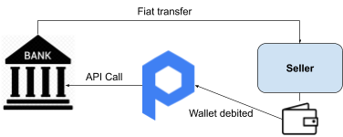

# Omnibus Banks

The omnibus bank plays a critical role in the Provenance ecosystem, providing a bridge between Provenance blockchain and fiat currency.  

The primary role of the omnibus bank is to hold fiat deposits and correspondingly mint and burn stablecoin on Provenance to match these fiat deposits.  Stablecoin is critical to support bilateral transactions on Provenance that are absent of counterparty and settlement risk.  Banks take ownership of and use a Figure-built API to interface with Provenance.  Banks earn float on the fiat deposits underlying the stablecoin for the performance of the minting and burning functions.

#### Process Flow Example 

Assume a fund is buying a pool of loans that are registered on Provenance.  That fund enters into a sale agreement with the seller and wires the transaction amount \(with an identifier\) to an omnibus bank.    

The omnibus bank uses the API call to Provenance to create stablecoin in an equal amount to the wire received and deposit the stablecoin into the fund’s wallet on Provenance \(signified by the identifier in the wire\).   
  

Provenance then transfers the agreed amount of stablecoin from the fund’s wallet to the seller’s wallet and transfers ownership of the loans to the fund at the same time.  This a T+0 transaction with no counterparty or settlement risk.  

Wallet owners on Provenance can redeem their stablecoin from the omnibus bank at any time.  In doing so, the omnibus bank destroys \(burns\) the stablecoin and transfers the corresponding amount of fiat to the redeemer's target fiat account.    

#### Stablecoin Properties  

Every stablecoin has a “minter” - the bank that created the coin.  Only nationally chartered banks with access to the fed settlement system will be allowed to be omnibus banks for stablecoin.      

Fiat deposits underlying the stablecoin are not committed to escrow; rather they are a fungible liability \(or sold asset, discussed below\), and the creditworthiness of the stablecoin is the creditworthiness of the omnibus bank “minter”.    

Using the example above, if the fund had an account with the omnibus bank, the fund can simply wire the money to its own account and request it be converted to stablecoin via minting, with the fund wallet address in the wire.  On such action, the bank is essentially selling stablecoin to the fund, creating a stablecoin liability offset by the cash asset, where the cash is unencumbered.  However, banks might want to represent the stablecoin as a special deposit \(though still fungible to general liabilities\), requiring redemption of the stablecoin to access.  

Should the fund not have an account with the omnibus bank, PBI, Provenance Blockchain Inc., has a master account with each omnibus bank that approved parties can access to transact on Provenance.  In these situations, Figure - by agreement with PBI - is responsible for the BSA/AML of the counterparty.  The accounting for the bank is the same as in the example outlined above.  

Ultimately we believe omnibus banks will look at stablecoin as the equivalent to a short term debt issuance \(though redeemable any time and at zero coupon\), and thus eliminate the need for an explicit account.  Rather the omnibus bank would mint and destroy coins in the open market, on demand.  

In situations where two parties transact on Provenance using an omnibus bank’s stablecoin, the omnibus bank is removed from such transaction and not responsible for BSA/AML on either party.  

In addition to providing a bridge between blockchain and fiat, omnibus banks can perform other functions.  For example, Figure uses these banks to fund loans and receive payments on issued loans.  Figure Pay, another example, pays the omnibus bank supporting the platform fees for blockchain rail payments, bin sponsorship and integration into Fed settlement systems.  

The benefit of a bank being an omnibus bank is the float from minting stable coin and any transaction fees, custody fees or other fees provided to individuals and institutions transacting on Provenance.    

