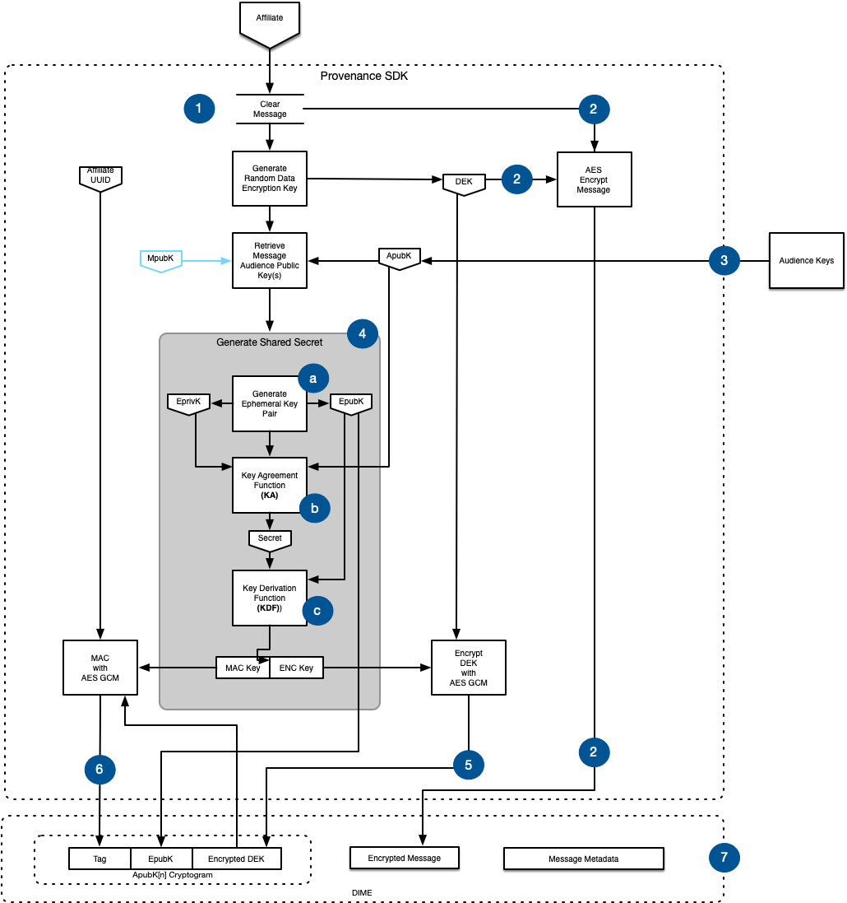
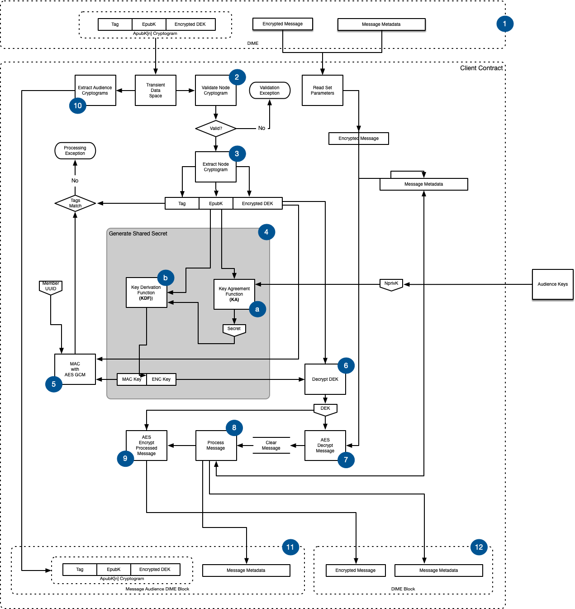

# EOS Encryption Scheme

Provenance Blockchain uses Elliptic Curve Integrated Encryption Scheme \(ECIES\) to encrypt asset before it is stored in the Encrypted Object Store.  As its name properly indicates, ECIES is an integrated encryption scheme which uses the following functions:

* Key Agreement \(KA\): Function used for the generation of a shared secret by two parties.
* Key Derivation Function \(KDF\): Mechanism that produces a set of keys from keying material and some optional parameters.
* Encryption: Symmetric encryption algorithm.
* Message Authentication Code \(MAC\): Data used in order to authenticate messages.
* Hash \(SHA-256\): Digest function, used within the KDF and the MAC functions.

The Provenance Blockchain ECIES scheme follows the ISO/IEC 18033-2 standard utilizing the following parameters:

<table>
  <thead>
    <tr>
      <th style="text-align:left">Parameter</th>
      <th style="text-align:left">Definition</th>
    </tr>
  </thead>
  <tbody>
    <tr>
      <td style="text-align:left">Key Agreement</td>
      <td style="text-align:left">Diffie-Hellman</td>
    </tr>
    <tr>
      <td style="text-align:left">Key Encapsulation Method</td>
      <td style="text-align:left">
        
ECIES-KEM, as defined in ISO 18033-2:

        <ul>
          <li>EC: prime256v1 (NIST P-256)</li>
          <li>CheckMode, OldCofactorMode, SingleHashMode, and CofactorMode are 0</li>
          <li>Point format is uncompressed</li>
        </ul>
      </td>
    </tr>
    <tr>
      <td style="text-align:left">Key Derivation Function</td>
      <td style="text-align:left">
        
HMAC-based with SHA-256 (HKDFwithSHA256)

        
Binary representation of an Ephemeral Public Key used as optional parameter

      </td>
    </tr>
    <tr>
      <td style="text-align:left">Symmetric Encryption Algorithm</td>
      <td style="text-align:left">AES-256 with Zero IV</td>
    </tr>
    <tr>
      <td style="text-align:left">Message Authentication Code Algorithm</td>
      <td style="text-align:left">
        
HMAC-SHA-256

        
Invoking Member UUID used as optional parameter.

      </td>
    </tr>
  </tbody>
</table>

### Encrypting Messages 

The following diagram demonstrates how the Provenance Blockchain SDK encrypts asset data prior to saving to the Encrypted Object Store and invoking client contracts.

1. The Affiliate uses the Provenance Blockchain SDK to encrypt data prior to saving to the Encrypted Object Store before it is used in contract execution.
2. A random, symmetric Data Encryption Key \(**DEK**\) is generated for each Member message.  The DEK is used to encrypt the message using AES.
3. The Audience is a set of Provenance Blockchain member public keys \(**ApubK**\) that are allowed to decrypt the encrypted the message. There may be 1 or many ApubKs.
4. A shared secret must be generated to allow the Audience to decrypt the DEK to subsequently decrypt the message.
   1. An ephemeral key pair is generated where the public key \(**EpubK**\) is derived from the private key \(**EprivK**\).
   2. The Key Agreement \(**KA**\) function uses the EprivK and ApubK to generate a secret \(**Secret**\).
   3. The Key Derivation Function \(**KDF**\) uses the Secret and the EpubK encoded as a byte array parameter to generate the Message Authentication Code key \(**MAC Key**\) and the Encryption Key \(**ENC Key**\).
5. The DEK is encrypted with the ENC Key using AES GCM resulting in an **Encrypted DEK**.
6. With the Encrypted DEK, the MAC Key, and the Member UUID as parameters a MAC function \(using AES GCM\) is used to produce a tag \(**Tag**\).
   1. The Tag is an AES-GCM authentication tag that is to be used during decryption validation.
7. A Provenance Blockchain Data Integrity & Message Encryption \(**DIME**\) packet is created that contains:
   1. A cryptogram \(Tag, EpubK, Encrypted DEK\) for each ApubK including a cryptogram for MpubK.
   2. A payload block with the Encrypted Message.
   3. Metadata about the DIME like asset ID, date, key value sets.

### Processing Encrypted Messages in Client Contracts 

This section describes how client contracts process encrypted information created in the previous section.  Each participant in the transaction invokes the contract. Thus, the context of the execution outlined in the following diagram is any participant in a transaction.

1. In the previous section, the Affiliate used the SDK to encrypt the message and create a set of audience cryptograms \(**ApubK**\[n\] Cryptogram\).
   1. The audience cryptogram set is a list of participants that are granted permission to decrypt the message.
   2. The audience cryptogram is submitted to the contract in a transient data space.
   3. The Encrypted Message and Message Metadata is passed to permissioned participants and is stored in their Encrypted Object Store.
2. The client contract run uses its **NpubK** to determine if it is in the ApubK\[n\] Cryptogram set.
   1. If the contract is not a valid ApubK\[n\] Cryptogram audience participant, the contract throws an exception and the transaction is rejected.
3. The client contract extracts the **Tag**, **EpubK**, and **Encrypted DEK** from its ApubK\[n\] Cryptogram into memory.
4. The ECIES shared secret must be generated to decrypt the Encrypted DEK
   1. The same Key Agreement function \(**KA**\) used to encrypt the DEK is followed.  During decryption, the KA function uses the EpubK from the cryptogram and the contract's NprivK to generate a **Secret**.
   2. The Key Derivation Function \(**KDF**\) uses the Secret and the EpubK encoded as a byte array parameter to generate the Message Authentication Code key \(**MAC Key**\) and the Encryption Key \(**ENC Key**\).
5. With the MAC Key, the Encrypted DEK, and the invoking Affiliate's UUID a new Tag is computed and compared with the Tag from the ApubK\[n\] Cryptogram.
   1. If the tags do not match, the contract throws and exception and the transaction is rejected.
6. With the ENC Key, the Encrypted DEK is decrypted into a clear DEK.
7. The Encrypted Message from the DIME is decrypted using the DEK resulting in a **Clear Message**.
8. The client contract processes the Clear Message including:
   1. Message validation
   2. Altering the message
   3. Reading the DIME Message Metadata \(e.g. asset ID, information about the message like key value sets\) and including or altering the message based on the metadata.  May alter the metadata.
9. When the client contract is done processing the Clear Message, it is encrypted with the DEK resulting in a new Encrypted Message.
   1. The DEK is destroyed from memory.
10. The audience cryptograms are processed resulting in a set of audience cryptograms containing only participants that are privileged to decrypt the message.
11. The client contract wraps the filtered cryptogram set, along with Message Metadata in a **Message Audience DIME**
12. Finally, the client contract wraps the Encrypted Message and Message Metadata in a DIME.

