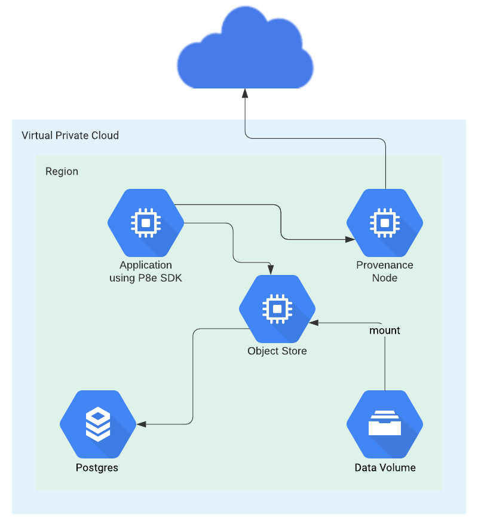

# Architecture

## Diagrams

#### Port Mappings

Encrypted Object Store does not currently contain any authentication mechanism. If you have a desire to publicly expose your instance, authentication and authorization should be provided externally, for instance with an API gateway.

Default port mappings \(NOTE: these are all configurable and can be changed\):

* Encrypted Object Store
  * ingress - tcp:80
* Provenance Blockchain Node
  * internet egress - tcp:26656
  * ingress - tcp:26656-26657, tcp:9090, tcp:1317

## Logical Description

#### Encrypted Object Store \(EOS\)

Object store can run in a few different configurations based on the needs of your p8e environment.

* No external multi-parties - If your p8e environment will strictly be handling single party contracts, or multi-party contracts where all parties are within your p8e execution environment, a single, privately addressable object store node may be used. The replication feature can be disabled.
* External multi-parties - If your p8e execution environment needs to execute multi-party contracts with some parties that exist outside of your EOS, the following are required:
  * An  EOS for your own p8e execution environment
  * Replication feature enabled

#### Provenance Blockchain Node

A Provenance Blockchain node provides your P8e execution environment with a means to read events and send transactions to the distributed Provenance Blockchain network. See [here](../../blockchain/running-a-node/running-a-node-1/) for setup.

#### Postgres 13

EOS requires postgres for persisting data. The cpu and memory requirements will largely depend on the amount of data EOS environment will support.

