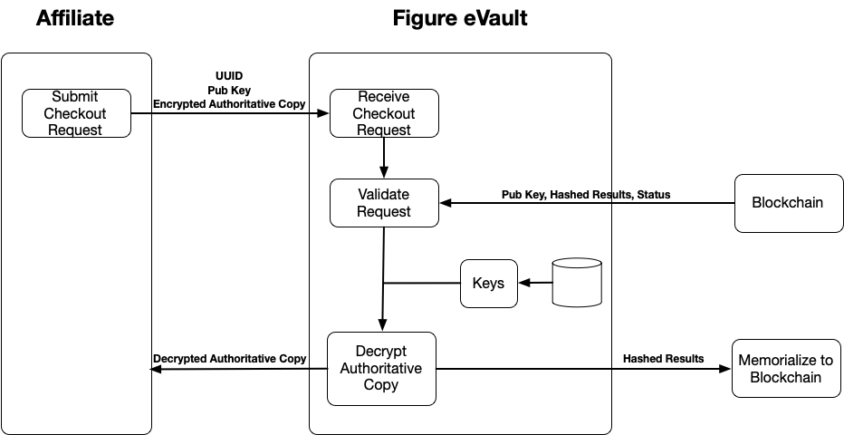
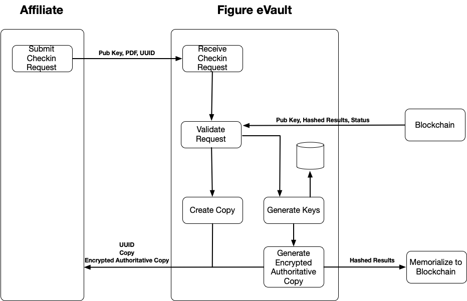

# eVault

## INTRODUCTION

Figure's eVault is built utilizing the Provenance Blockchain. The primary goal is to provide a system where a single authoritative copy of a transferable record can be retained. However, this process can be used for other documents as well. Documents that are requested to be vaulted are encrypted before ultimately being returned to the owner. The encryption keys are retained by the vault, thus preventing documents from being decrypted and copied without the owner's permission. This process also creates an immutable record of the document, including the document ID, document hashes, and a status of the document on the blockchain.

## Process Flows

### New Document

1. An affiliate submits a request to add a document to the vault. The submitter is considered the owner and includes their public key along with the document.
2. A unique UUID is generated and assigned to the document. This ID will be used when requests are made to check-out, check-in, or verify documents.
3. The system creates a digitally altered copy of the document. This copy will be returned to the owner where it can be viewed and shared by the owner.
4. The system generates keys that will be used to encrypt the authoritative copy once it has been generated. These keys will be retained by the system to ensure only the system will be able to decrypt the authoritative copy on the owner's request.
5. A digitally altered authoritative copy of the document is created and encrypted with the keys. This copy will also be returned to the owner but only the encrypted version. Since the owner won't have a copy of the keys, they will be unable to decrypt the authoritative copy without using the system.
6. A record of the document is memorialized to the blockchain. This record will consist of the following fields:
   * UUID
   * Owner's public key
   * Document State \(Checked-in/Checked-out\)
   * Hashed representations of the original document, the copy, and the authoritative copy
7. The UUID, the copy, and the encrypted authoritative copy are returned to the owner.

### Check-out Document

1. The owner of the document submits a request to checkout a document from the vault. The owner includes their public key in the request in addition to the UUID and encrypted authoritative copy returned to them when the document was added to the vault.
2. The encrypted authoritative copy is hashed and compared with the hash from the blockchain to ensure the document hasn't been altered. The status is also checked to ensure the document is currently checked in.
3. The keys used to originally encrypt the document are retrieved from the vault.
4. Using the keys, the authoritative copy is decrypted.
5. A status change of Checked-out is memorialized to the blockchain.
6. The decrypted authoritative copy is returned to the owner.

### Check-in Document

1. The owner of the document submits a request to check a document back in to the vault. The owner again includes their public key in the request in addition to the UUID and decrypted authoritative copy.
2. The authoritative copy is encrypted using the original keys, hashed, and compared with the hash from the blockchain to ensure the document hasn't been altered. The status is also checked to ensure the document is currently checked out.
3. A new digitally altered copy of the document is created. This copy will be returned to the owner where it can be viewed and shared by the owner.
4. New keys are generated that will be used to encrypt the authoritative copy once it has been generated. These keys will be retained by the system to ensure only the system will be able to decrypt the authoritative copy on the owner's request.
5. A digitally altered authoritative copy of the document is created and encrypted with the new keys. This encrypted copy will again be returned to the owner.
6. An updated record of the document, including the updated checked-in status, is memorialized to the blockchain.
7. The UUID, the copy, and the encrypted authoritative copy are returned to the owner.

